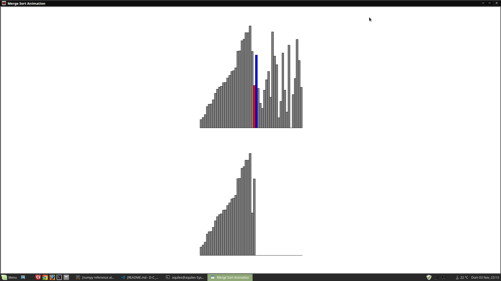

# Merge Sort

## Alunos
|Matrícula | Aluno |
| -- | -- |
| 16/0010331  |  José Aquiles Guedes de Rezende |

## Sobre 
Implementação de animação do comportamento do merge sort. Com o usuário podendo comparar o tempo de execução da montagem da animação e sem animação.

## Screenshots

## Instalação 
**Linguagem**: python3 
**Requisitos**: python3-tk

## Referencia

[python turtle academy](https://pythonturtle.academy/quick-sort-animation-with-python-and-turtle-with-source-code/)

